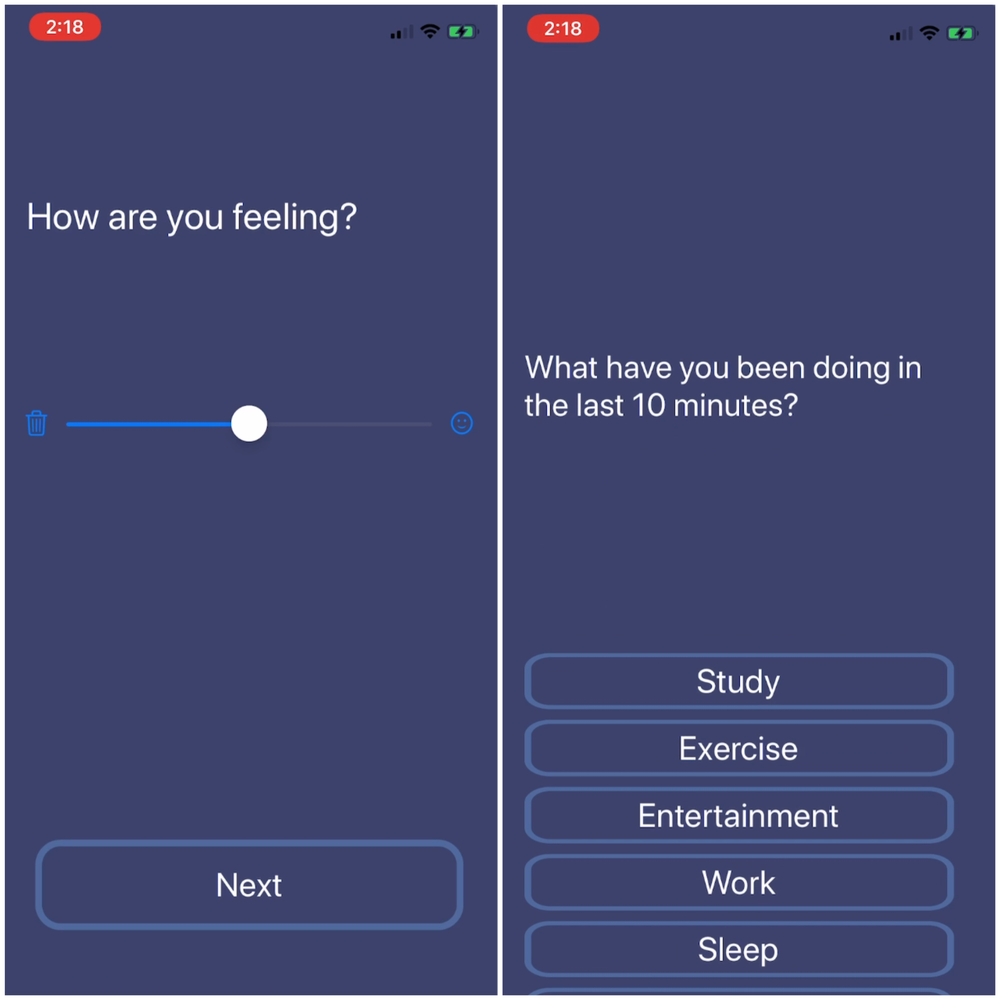
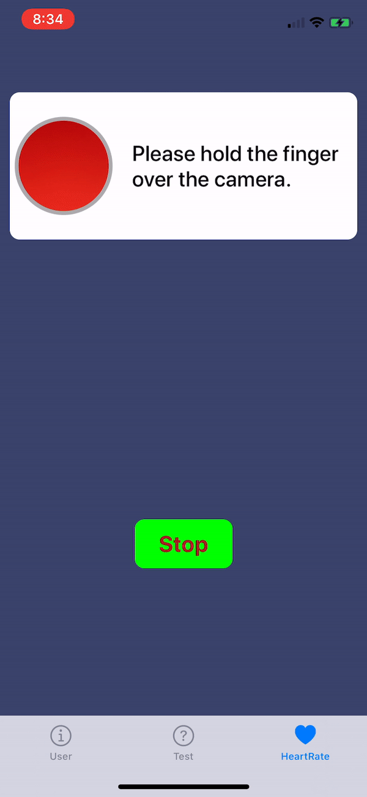

# Ecological Momentary Assessment Demo
[Requirements](#Requirements) | [Current State](#CurrentState) | [To do](#Todo) 

## Requirements

* Get timestamped RR intervals in millisecond accuracy
* Get real-time RR intervals relating to the tasks

## CurrentState

* Finished the front-end of Questionnaire data collection (choice questions and scale questions)

  

* Can read heart rate data from Apple Watch

* Can get image samples from camera in milliseconds accuracy

  

## Todo

* Implement HRV detection using phone camera
* Build back-end platform to store data
* User info input
* Improve User Interface
  * Images need to be replaced
  * Add Back button
  * Label layout
