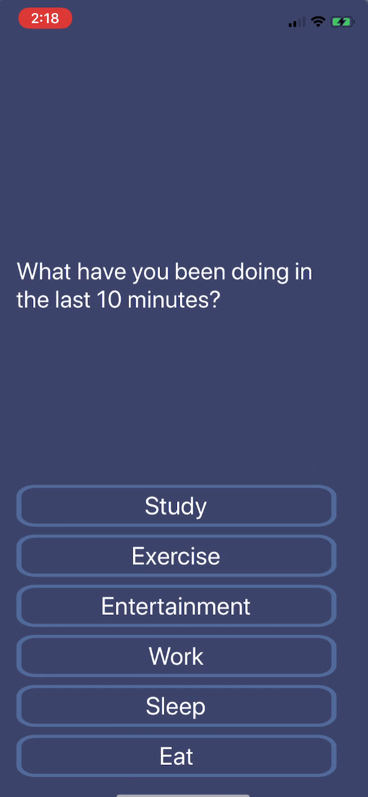
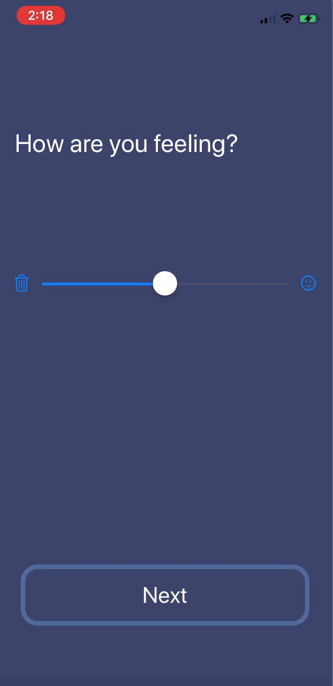

# Ecological Momentary Assessment Demo
[Current State](#CurrentState) | [To do](#Todo) | [Requirements](#Requirements)

## CurrentState

* Finished the front-end of Questionnaire data collection (choice questions and scale questions)
 <!-- .element height="50%" width="50%" -->
 <!-- .element height="50%" width="50%" -->

* Can read heart rate data from Apple Watch

## Todo

* Implement HRV detection using phone camera
* Build back-end platform to store data
* User info input
* Improve User Interface
  * Images need to be replaced
  * Add Back button
  * Label layout

## Requirements

* Get timestamped RR intervals in millisecond accuracy
* Get time series relating to the tasks

